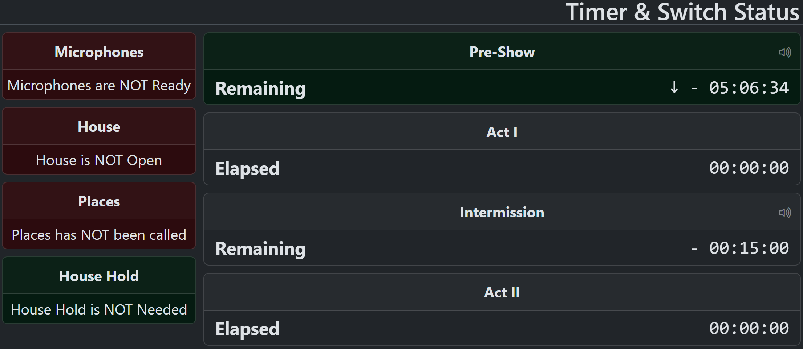
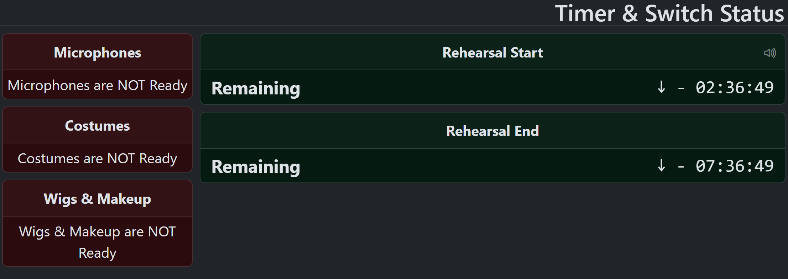
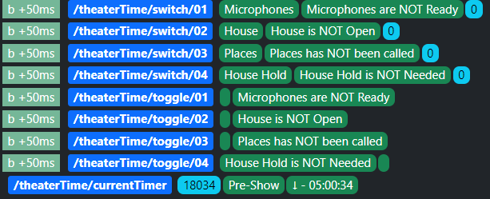
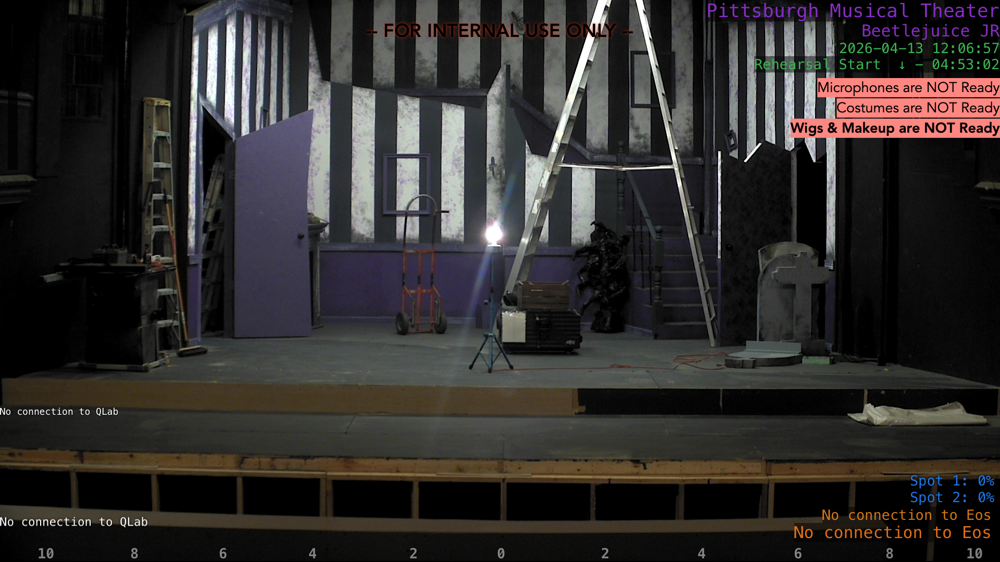
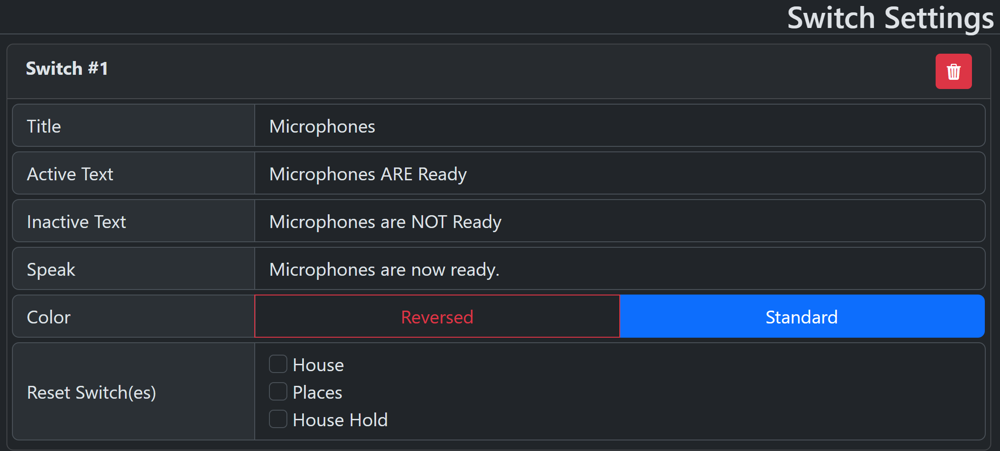
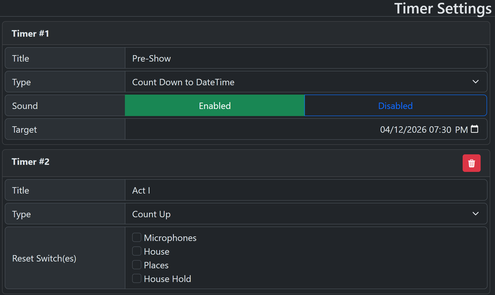
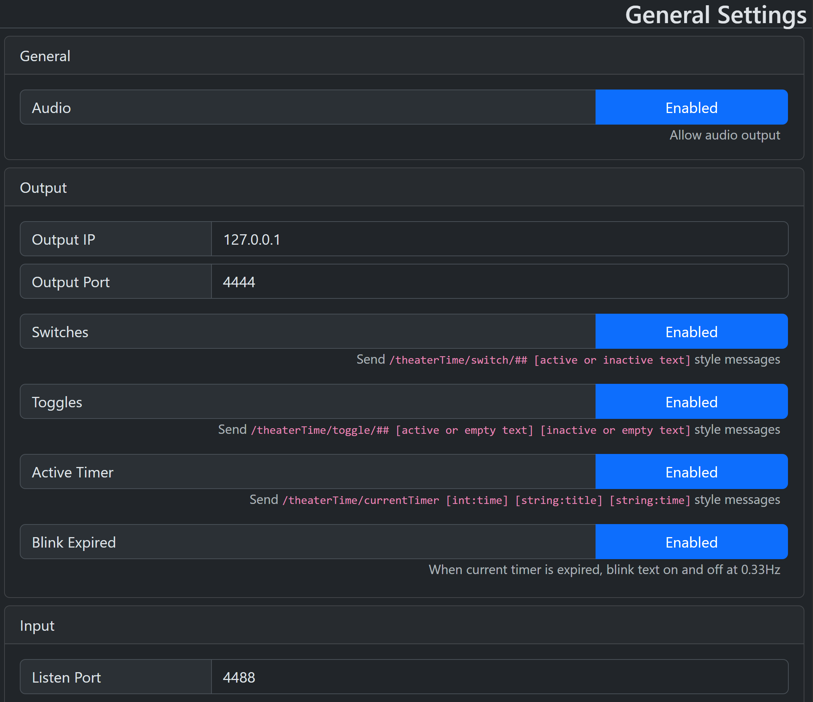

# TheaterTime

Simple Theater Timer for Events and Shows

## What it is

This is a simple timer that can keep track of a theater performance (or really any sequential event).  It outputs all of it's data via OSC and via a simple web interface.  Interaction is OSC message based, although some simple interactions are available in the "admin" web interface.  OSC output is specifically tailored to work well with [Vor](https://www.getvor.app/)






## Features

- Countdown to absolute time timers (show start)
- Countup from zero timers (Acts, Scenes, whatever)
- Countdown to an absolute number of minutes (intermissions)
- Toggle switches that can optionally be tied to timers (places, house open, etc)
- Audio feedback on the main process for switches and countdown timers ("10 Minutes, please"; "This is your places call")

## Switches

Switches are ON/OFF Data points. You can activate of deactivate them manually, and they can also be deactivated when another switch is thrown, or a timer is started. _As a note, the documentation assumes you won't have more than 99 switches - this isn't a real limit, but 2-digit padding is used for output._

- __Active / Inactive Text__ : The text displayed when the switch is active or inactive
- __Color__ : Standard is to use green when on, and red when off.  Reversing does the opposite
- __Speak__ : A text string that will be machine-spoken when the switch is toggled active
- __Reset Switch(es)__ : These are the switches that will be set to inactive when this switch is set active



## Timers

Timers keep time.  They can track time _until_ an event, or time _elapsed_ in an event.  You can only have 1 timer active at a time, but there are provisions for running inactive timers, depending on type.

- __Count Down__ : This timer type counts down to a pre-specified DateTime. For instance, your event starts today at 7:30PM.  You can have multiple count-down timers, and they all run automatically from start, and stop when marked inactive.
- __Count Up__ : This timer type tracks elapsed time.  Only one count-up timer can be active at a time. For instance, an act timer.
- __Count Minutes__ : This timer type counts down to a pre-specified number of minutes. For instance, a 15 minute intermission.  Only one minute count-down timer can be active at a time.

Additional options are available on some timers

- __Sound__ : The system will speak `"## Minutes Please.  ## Minutes"` for 90, 60, 30, 20, 15, 10, and 5 minutes remaining.  This setting is unavailable on count-up timers.
- __Reset Switch(es)__ : These are the switches that will be set to inactive when this timer is set active.  This setting is unavailable on count-down type timers.
- __Minutes__ : The number of minutes to count (plus 2 seconds, so audio plays correctly). This settings is only available on minute count-down type timers.
- __Target__ : The target DateTime to count-down to.  This setting is only available on count-down type timers.



## OSC Input

The recommended method of interacting with TheaterTime is to use OSC messages.



### Switch OSC

- __Toggle a switch active__ : `/theaterTime/switch/on [int:1..99]`
- __Toggle a switch inactive__ : `/theaterTime/switch/off [int:1..99]`
- __Toggle a switch to it's opposite state__ : `/theaterTime/switch/toggle [int:1..99]`

### Timer OSC

- __Advance to the next timer__ : `/theaterTime/timer/next`
- __Return to the previous timer__ : `/theaterTime/timer/previous`
- __Stop all timers__ : `/theaterTime/timer/stop`

### Other OSC

- __Reset all timers and switches__ : `/theaterTime/reset`
- __Speak an arbitrary string__ : `/theaterTime/speak [string]`

## OSC Output

TheaterTime is intended for use with Vor - but it can talk to any application that consumes OSC.  Configuration of which items to send are on the settings page, their output is explained here.

### Switch Single

- `/theaterTime/switch/[01..99] [s:Title] [s:Active/Inactive Text] [i:0/1]`
- __Inactive Example__
  - `/theaterTime/switch/01 [s:"House"] [s:"House is NOT Open"] [i:0]`
- __Active Example__
  - `/theaterTime/switch/01 [s:"House"] [s:"House is OPEN"] [i:1]`

### Switch Toggle

- `/theaterTime/toggle/[01..99] [s:Active text/empty] [s:Inactive Text/empty]`
- __Inactive Example__
  - `/theaterTime/toggle/01 [s:""] [s:"House is NOT Open"]`
- __Active Example__
  - `/theaterTime/toggle/01 [s:"House is OPEN"] [s:""]`
- __Reverse Color__
  - `/theaterTime/toggle/[01..99] [s:Inactive Text/empty] [s:Active text/empty]`
  
### Current Timer

- `/theaterTime/currentTimer [i:Seconds] [s:Title] [s:Time String]`
- __Example__
  - `/theaterTime/currentTimer [i:19607] [s:"Pre-Show"] [s:"↓ - 05:26:47"]`
- __Expired Example__
  - `/theaterTime/currentTimer [i:-2141] [s:"Pre-Show"] [s:"↓ + 00:35:41"]`
- __Blink Example__
  - `/theaterTime/currentTimer [i:-2187] [s:""] [s:""]`

## License

Do whatever you like with this code. If it might be helpful to others, maybe open a pull request.

## A Note about power saving

Most of the power saving features of chromium (electron renderer) have been disabled for this application.  This is done so that audio announcements play even if TheaterTime is hidden or minimized.  The down side of this is that TheaterTime will always use the CPU, and if you are running it on a laptop, a bit more battery.

## qLab Integration

Most of this is very straightforward - you just need a proper network entry


If you wish to use the "speak arbitrary message" function, and would like to have qLab prompt you for the message, you will need 2 cues:

- __SPEAK__ - A network cue pointed to the TheaterTime Patch
- ___???___ - A script cue with the following script in it:

```applescript
tell application id "com.figure53.QLab.5" to tell front workspace
    set prevCommand to notes of cue "SPEAK"
    if prevCommand is "" then set prevCommand to "Hello"

    display dialog "" default answer prevCommand with title "Text to speak" buttons {"Cancel", "OK"} default button "OK" cancel button "Cancel"

    set theCommand to text returned of result

    set notes of cue "SPEAK" to theCommand
    set oscCommand to "/theaterTime/speak " & quote & theCommand & quote
    set parameter values of cue "SPEAK" to {oscCommand}
    start cue "SPEAK"
end tell
```
